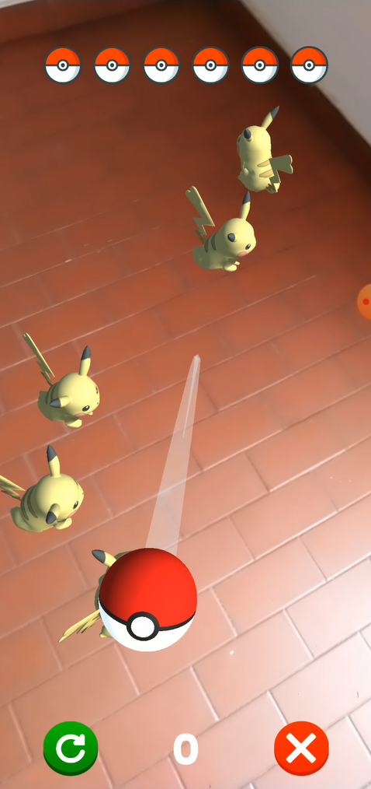

# Sapan Oyunu
# MUHAMMED EMİN GÜNEŞ 210542022  

## PROJE ADI
Sapan Oyunu

## PROJE AÇIKLAMASI
"Sapan Oyunu" projesi, artırılmış gerçeklik (AR) teknolojisini kullanarak eğlenceli ve interaktif bir oyun deneyimi sunmayı hedefleyen bir mobil uygulamadır. Oyunda, kullanıcılar bir sapan yardımıyla hedeflere nişan alarak puan kazanmaya çalışır. Proje, Unity oyun motoru ile geliştirilmiş olup, AR teknolojisiyle zenginleştirilmiştir. Eğlence ve öğrenmeyi birleştirerek hem keyifli bir zaman geçirme hem de mekanik öğrenme fırsatı sunar.

## DÖKÜMANLAR
Proje belgeleri: [Proje Belgeleri GitHub](https://github.com/eminguness/YMGK/tree/main/belgeler)

## Trello 
Trello çalışma panom: [Trello](https://trello.com/b/9vUOwjp9/ymgk)

## APK dosyası 
APK dosyam: [APK GitHub](https://github.com/eminguness/YMGK)

## Projemin Kodları 
Kodlar: [Kodlar Google Drive](https://drive.google.com/drive/folders/1vp502YghpzX2yJmfUu-Psy2RHyCRKNn6?usp=sharing)                   

## Oyundan Görseller
Aşağıda oyunun çeşitli ekran görüntüleri yer almaktadır:

### Görsel 1: Oyun Tanıtımı

### Görsel 2: Nesne Düşüşü

### Görsel 3: Liderlik Tablosu

### Görsel 4: Uçak Seçimi

### Görsel 5: Oyun Başlangıcı

